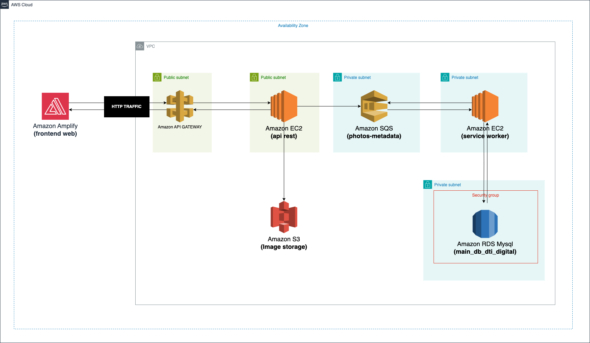

# dti-digital technical assesment

Backend implementation for dti-digital technical challenge, rest api managing users and their photo-albums data. 

## Live demo

## Technologies

- NodeJS
- Typescript
- Jest
- ESLint
- Husky
- Lint staged
- Git commit message linter

## Setup

## Tests

## Architecture

### Cloud

The cloud architecture relies on AWS. 
Front-end will be hosted in AWS Amplify communicating with backend services hosted in AWS EC2 via API Gateway. 
Front-end is responsible to validate the image size and resize it when needit, once this is not a real life application the maximum size of image allowed to upload is 5MB 
All APIS are stored in EC2 instance connected directly to the API Gateway, one of its endpoint upload the image to S3 and send metadata to a queue. 
The metadata pushed to the queue holds the image link, title(optinal), description(optional) and once the service worker gets this metadata from queue a relational database is written to keep the data stored. 
 

## Code design

## Extra
- There are rulesets configured for this repository like branch protection, enforcing pull requests on develop, hml and main branches. Feat and bugfix branches are not included in this ruleset.